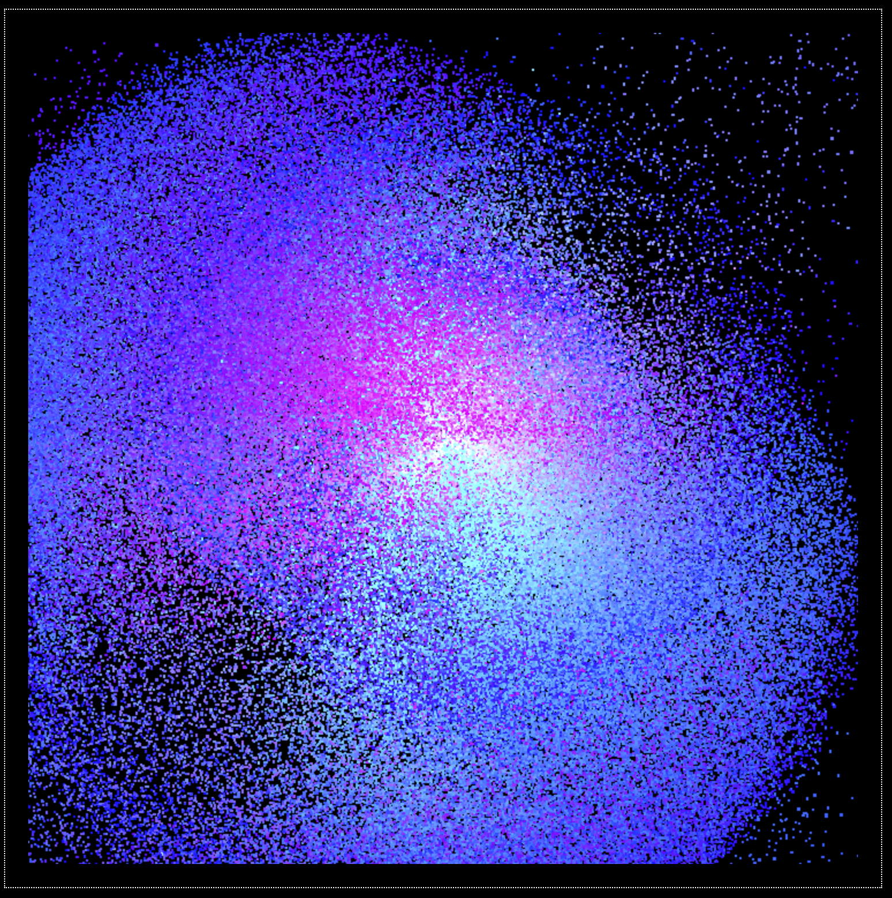

# Minimal WebGPU Compute Shader Particle System

This is a minimal example of a particle system using WebGPU compute shaders. The project uses a minimal setup with vite and typescript. 

## Usage

```bash
npm install
npm run dev
```

## Credits

Based on [Your first WebGPU app](https://codelabs.developers.google.com/your-first-webgpu-app#4). Very much recommended to get started with WebGPU compute shaders. 

